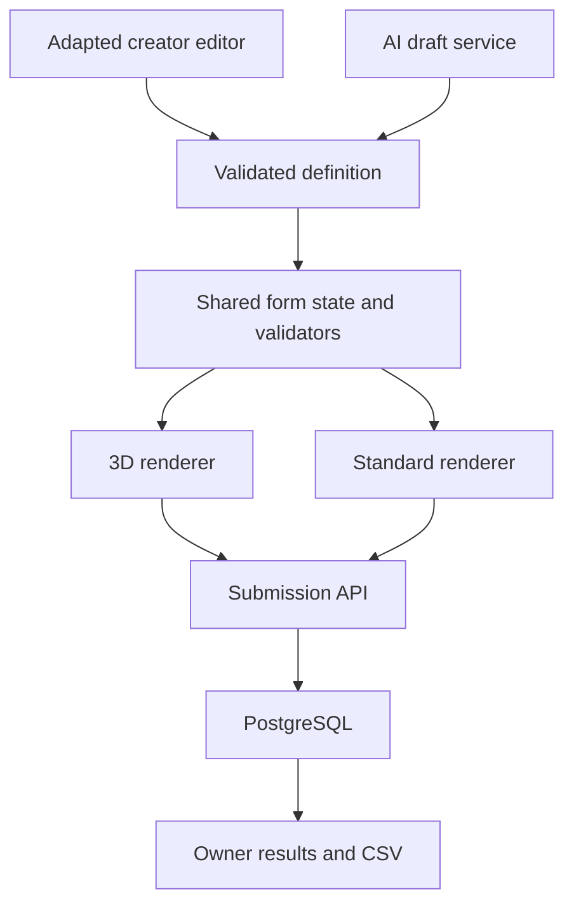
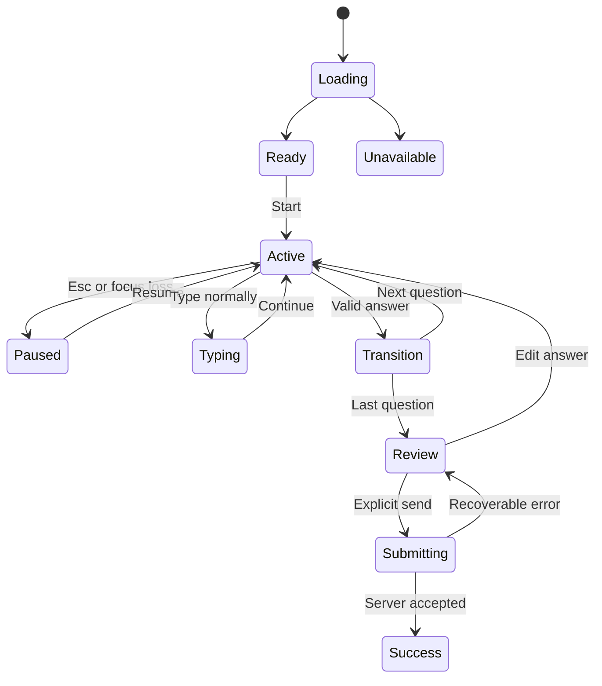

# Gamyform — MVP specification & full vision paper

**Product name:** Gamyform. Commercial name clearance has not been evaluated.  
**Target repository:** [Skralo/Gamyform](https://github.com/Skralo/Gamyform), public and empty when inspected on 21 September 2026.  
**Owner:** Anže Skralovnik / SKRALOVNIK.  
**Prepared:** 21 September 2026.  
**Status:** Product and engineering specification, including MVP requirements and full future vision. The first MVP implementation is included in this repository; it is not publicly deployed. See [verification and remaining release gates](verification.md) for implemented behavior and outstanding checks.  
**Delivery constraint:** A 2–3 day build sprint. This is a time budget, not a guaranteed delivery estimate.  
**Document language:** Slovenian executive brief; English specification for direct use by a coding AI agent.

---

## 1. Kratek produktni brief

Gamyform spremeni izpolnjevanje obrazca v kratko prvoosebno 3D izkušnjo. Obiskovalec stoji na mestu, z miško obrača pogled in s streljanjem izbira odgovore na tabli. Vsak zadetek sproži usklajeno animacijo in zadovoljiv zvok. Za številke strelja v + in −; za besedilo lahko strelja v tipke prostorske tipkovnice.

Ti v administraciji opišeš, kaj želiš izvedeti. AI pripravi vprašanja, ti jih urediš, preizkusiš in objaviš povezavo. Oddani kontakti se shranijo v preglednico v aplikaciji in jih lahko izvoziš v CSV.

**MVP je interni produkt za tvojo prvo kampanjo.** Celoten komercialni SaaS, avtomatski uvoz različnih form builderjev in generiranje okolja iz spletne strani sodijo v širšo vizijo.

**Realnost roka:** 2–3 dni je agresiven rok tudi za ta obseg. Izvedljivost je odvisna od izkušenj izvajalca, pripravljenega gostovanja, dostopa do AI API-ja in hitrosti ustvarjanja 3D assetov. Specifikacija zato določa preprosto arhitekturo, eno sceno, enega administratorja in jasen vrstni red. Če čas poteče, se nedokončana verzija označi kot prototip; funkcije se ne prikazujejo kot delujoče, če niso.

**Največja produktna nevarnost:** zanimivost igre še ne pomeni več oddanih kakovostnih kontaktov. Zlasti streljanje e-maila črko po črko je lahko zabavno prvih deset sekund, potem pa naporno. Zato je ohranjeno kot polnopravna funkcija, zraven pa je predlagan vnos z običajno tipkovnico. Ta dodatni način je priporočilo v tej specifikaciji, ne odgovor, ki ga je uporabnik izrecno izbral.

**Predlagana tehnična smer po dodatnem pojasnilu:** gradimo lastno aplikacijo v `Skralo/Gamyform`. Iz MIT projekta `hasanharman/form-builder` prevzamemo izbrane datoteke urejevalnika in polj ter jih prilagodimo. Uporabimo React Hook Form in skupne Zod validatorje, dodamo lasten 3D prikaz s Three.js / React Three Fiber ter lasten backend. Brez naročnine na tuj form-builder produkt. Natančen načrt prevzema kode je v razdelku 8. Stroški lastnega gostovanja in izbranega AI API-ja so ločeni od naročnine na form builder; njihov proračun še ni določen.

## 2. Confirmed requirements and explicit assumptions

### 2.1 Decisions from the ten-question interview

| ID | Confirmed decision | Consequence |
|---|---|---|
| U01 | First creator is Anže, for his own brand and projects | One owner account; no customer onboarding or billing |
| U02 | First use case is collecting contacts and enquiries | Valid email capture, reliable submission, and usable response export are core |
| U03 | Real 3D world, free look, stationary character | Actual 3D geometry and camera rotation; no walking or movement system |
| U04 | Desktop only for MVP | Mouse interaction; no mobile game controls |
| U05 | Shoot choices, shoot +/− for numbers, shoot keyboard keys for text | Three interaction components, including a shootable keyboard |
| U06 | AI creates a form from a description; creator edits it | Server-side AI generation plus a small structured editor |
| U07 | One hit confirms a single choice and moves forward; Back is available | Immediate logical selection, brief feedback transition, reversible navigation |
| U08 | One polished branded environment, weapon, and sound set | No theme marketplace or website-to-world AI in MVP |
| U09 | Responses in an in-app table, downloadable as CSV | Persistent database, owner-only results, export |
| U10 | 2–3 day build time | Strict scope; no hidden SaaS platform work |
| U11 | Own app built by reviewing, selecting and copying/adapting useful open-source code; no paid form-builder service | Source reuse is an explicit deliverable, not merely a list of SaaS alternatives |
| U12 | Existing target repository is `Skralo/Gamyform` | Use this repository for future implementation; it currently contains no files |

### 2.2 Proposed defaults, not additional user decisions

- One public standalone URL per form. Embedding is deferred.
- English is the default public-form language; Slovenian text is supported. Admin UI initially English.
- One owner may create several forms, all sharing the same scene preset.
- Target 3–7 questions per lead form; allow 1–10. Single-choice questions support 2–6 options.
- Include physical typing and a simple desktop standard-form mode as escape routes. They use the same question schema and submission endpoint.
- The first art direction is a dark teal and warm gold architectural courtyard, using existing SKRALOVNIK brand cues. This exact scene has not been chosen by the owner.
- The starter weapon is an original stylized pulse blaster with visible hands, not an asset copied from Fortnite.
- Deploy one Node application with a persistent PostgreSQL database. Use the identified empty `Skralo/Gamyform` repository. A hosting account and deployment credentials have not been identified.
- No email messages, marketing automation, or CRM actions happen after submission in MVP.

These defaults make the specification implementable without another questionnaire. Record any change to them in the project's decision log.

## 3. Product purpose and success conditions

### 3.1 Product promise

For a creator, turn a short lead form into a memorable interactive brand experience without manually designing a game. For a respondent, answer a few questions through satisfying interactions and understand exactly when information is submitted.

### 3.2 Jobs to be done

**Creator:** “I want to ask potential clients a few questions, make the interaction feel like my brand, and collect usable contacts without building an experience from scratch.”

**Respondent:** “I want to express what I need and leave my contact quickly, while enjoying the experience and retaining control over my answers.”

### 3.3 What success means for the first release

1. Anže can generate, edit, preview, publish, close, and inspect a real form.
2. A desktop visitor can finish it without instructions from Anže.
3. Every accepted submission appears exactly once in the owner table and CSV.
4. 3D targeting and audio feel immediate on the tested laptop.
5. Incorrect input and network failure have clear recovery paths.
6. The experience does not reward particular answers, speed, or willingness to provide more personal information.

Higher conversion is a hypothesis to test, not a claim to publish at launch. A fast, attractive demo alone does not validate demand for a paid product.

## 4. MVP scope contract

### 4.1 Required for the complete MVP

| Area | Required behavior |
|---|---|
| Owner access | One authenticated owner; server-enforced protection for all admin routes |
| Form creation | Description → validated AI draft; clear errors and manual creation fallback |
| Editor | Edit title, description, questions, options, required flags, number bounds; add/remove/reorder using buttons |
| Preview | Test the actual 3D runner; preview responses never enter production results |
| Publication | Draft and immutable published versions; copy public URL; close a form |
| 3D runtime | Stationary camera position, free yaw, bounded pitch, visible hands and blaster, board and answer targets |
| Feedback | Aim indication, shot effect, target impact, confirmation sound, restrained transitions |
| Choice input | Single-choice shot selects and advances; Back restores answer |
| Number input | Shoot +/−; explicit Confirm; bounded integer values |
| Text input | Shootable keyboard, delete, space, case/symbol controls, Confirm; optional physical typing |
| Review and submit | See all answers, edit any answer, deliberately submit; success only after server acknowledgement |
| Persistence | Published definitions and accepted submissions survive app restarts |
| Results | Response list, response detail, CSV export, owner deletion of a response |
| Recovery | Pause/resume, mute, standard desktop mode, validation errors, retry without duplicate submission |
| Measurement | Minimal anonymous funnel events and submission counts; no chart suite |

### 4.2 Explicitly outside the sprint

Mobile gameplay; customer signup; subscriptions; teams; custom domains; iframe embed; branching logic; calculations; file uploads; payment fields; multi-select questions; drag-and-drop editing; an import UI; connectors; webhook delivery; AI-generated 3D models; website crawling; multiple weapons; multiplayer; movement; scores; leaderboards; physics simulation; verified-email flows; cross-device resume; a full analytics dashboard.

Do not build disabled placeholder buttons for these capabilities. Describe them in the roadmap instead.

### 4.3 Allowed simplifications if the sprint is tight

Reduce scenery detail, use procedural geometry, use one restrained sound set, omit response search, use a plain HTML table, use arrow buttons instead of drag-and-drop, and export all responses without elaborate filters.

Do not quietly remove true 3D, the shootable keyboard, AI drafting, real persistence, or owner access and still call the result the requested MVP. If any of these is unfinished, report a partial prototype and list the gap.

## 5. User journeys and screens

### 5.1 Creator journey

1. Sign in to the owner dashboard.
2. Select **Create form**.
3. Enter a description, language, and desired length, e.g. “Create a short enquiry form for my AI systems service. Ask what they need help with and collect name and email. English, five questions.”
4. Click **Generate draft**. Display pending state, then a structured list of questions.
5. Edit wording, types, options, and requirements. AI output is always an editable draft.
6. Preview in a separate route/tab, clearly labelled Preview.
7. Publish after schema validation; receive a shareable link.
8. Open **Responses** to inspect received information and export CSV.

### 5.2 Respondent journey

1. Open the public link. A lightweight start screen shows the purpose, question count, sound choice, controls, and a privacy-information link.
2. Click **Start experience**. Load/start the scene and request pointer lock through the user gesture. The activation click must not fire the weapon.
3. Shoot one practice target. Practice does not affect answers or analytics completion. A visible Skip is available.
4. Answer one question at a time on the board.
5. Use Back to change answers, Esc to pause, or Switch to standard form.
6. Review answers. Shoot **Send enquiry** or click the equivalent ordinary button.
7. Display pending submission. Show success and a short completion effect only after durable server acknowledgement.

### 5.3 Screen inventory

| Screen | Primary content | States |
|---|---|---|
| Owner login | Password entry for pre-provisioned owner | Idle, pending, rejected, rate-limited |
| Forms | Title, publication status, response count, Edit, Responses | Empty, populated, failed load |
| Editor | Brief input, question list, field properties, Preview, Publish | Unsaved, saving, saved, generation pending, validation error |
| Preview | Real game runner and Preview marker | No production submission possible |
| Start | Form purpose, count, controls, sound toggle, standard-mode link | Loading assets, ready, unavailable, unsupported |
| Game | Scene, question board, targets, crosshair, hands/blaster, progress | Active, transitioning, paused, typing, validating |
| Review | Answer summary and explicit send action | Editing, pending send, recoverable failure |
| Success | Confirmation and optional owner-configured next link | Accepted submission only |
| Responses | Paginated table, detail view, export | Empty, loaded, failed, exporting |
| Unsupported device | Desktop requirement and copy-link action | No attempt to run touch shooting |

### 5.4 Editor boundaries

- Keep questions in a vertical list. Selecting a question exposes properties alongside it.
- Support **Add**, **Duplicate**, **Delete**, **Move up**, and **Move down**. Duplicated questions receive new IDs.
- Use plain text only. Render AI/user strings as text; never accept executable HTML or JavaScript.
- Save with an explicit button and visible dirty state. Warn before leaving with unsaved changes.
- Preview reads a draft snapshot but cannot call the public submission endpoint.
- Regenerate replaces a draft only after a clear replace action. It never silently overwrites published content.
- Changing question type clears incompatible constraints/options with a visible warning.
- Publishing fails if required metadata, unique IDs, allowed values, or layout limits are invalid.

## 6. 3D experience specification

### 6.1 Scene and composition

Proposed preset: **SKRALOVNIK Courtyard**. A compact architectural courtyard at dusk with a deep teal presentation board, warm light, restrained stone columns, and a small amount of greenery. Use actual geometry, lighting and depth. Avoid an enormous environment whose content the stationary player cannot meaningfully use.

Suggested tokens: background `#05080a`, deep teal `#003042`, warm gold `#f5d592`, readable near-white text. These are inherited brand cues, not newly approved scene requirements. Use an easily read sans-serif for answer labels; reserve the brand's decorative typography for title treatment. Legibility outranks strict font fidelity inside the game.

The board remains fixed in the world in front of the initial camera heading. The visitor can look around 360° horizontally. Clamp vertical rotation to approximately ±75° to avoid flipping. The body does not move. Do not bind WASD to translation. Include **Recenter view** in the pause menu; do not unexpectedly rotate the visitor during an answer.

Use one board around 3–5 virtual metres away, tuned by readability rather than physical realism. Fit up to six answer targets in two columns and three rows. Keep the question above the options. Use a separate control row for Back, Skip when permitted, and Confirm where needed.

Hands and the weapon occupy the lower-right portion of the view and must not obscure targets, text, or the virtual keyboard. The keyboard replaces the answer layout on the same board. At 1366×768, keys must remain readable and their effective hit areas must not overlap.

### 6.2 Controls

| Input | Result |
|---|---|
| Start/Resume button | Acquire pointer lock; resume audio if allowed; never shoot from this click |
| Mouse movement | Rotate view, without changing camera position |
| Left mouse press | One shot, subject to cooldown and current state |
| Esc / lost pointer lock | Pause; suppress firing; reveal normal cursor and pause menu |
| Pause menu | Resume, mute/volume, recenter, standard form mode |
| Shoot Back target | Restore previous question and saved answer |
| Shoot Confirm | Validate active number/text question and advance |
| Shoot Type normally | Enter native text mode with an ordinary input |

Pointer lock is a browser-controlled feature and should be requested from an explicit user action. Audio also needs a user-gesture-aware start/resume flow. Handle rejection without freezing the experience. Sources: [MDN Pointer Lock](https://developer.mozilla.org/en-US/docs/Web/API/Pointer_Lock_API), [MDN autoplay](https://developer.mozilla.org/en-US/docs/Web/Media/Guides/Autoplay).

### 6.3 Targeting and firing

- Use a ray from the camera through the centre crosshair. Restrict targeting to registered interaction objects and explicit occluders.
- Choose the nearest valid unobstructed hit. Decorative background meshes must not become answer targets.
- Resolve the hit immediately. The visible projectile/tracer is cosmetic and never independently selects an answer.
- A registry entry contains interaction ID, question ID, scene-generation ID, action type, and mesh reference. Dispose registrations when a question changes.
- One mouse-down edge produces one shot. Default cooldown: 150 ms. No automatic firing while the mouse is held.
- Every shot may animate the weapon. Only valid target hits cause answer changes.
- Misses produce subtle feedback and no score penalty, data change, or progress.
- Do not rely solely on ordinary DOM pointer coordinates after pointer lock.

Three.js provides raycasting and first-person pointer-lock controls; the application supplies the answer semantics. Sources: [Raycaster](https://threejs.org/docs/pages/Raycaster.html), [PointerLockControls](https://threejs.org/docs/pages/PointerLockControls.html).

### 6.4 Single-choice answers

On valid hit, update the answer immediately, highlight the chosen target, play the same positive confirmation cue used for every option, and enter a transition lock of approximately 300 ms. Then show the next question without another confirmation action.

This fulfils immediate confirmation while leaving time to perceive the hit. During the transition, all answer inputs are ignored. Require release and a new mouse press before the next question can be answered. Associate shots with the active question generation so a stale callback cannot answer the next question.

Back returns to the prior question with the current selection indicated. A new shot replaces that answer. Following answers are preserved because MVP has no branching. Back from the first question is disabled. Final-question completion leads to Review, never directly to database submission.

### 6.5 Integer input

- Show the current value between two large + and − targets, with the step and bounds visible.
- An untouched field is logically unset even if a starting value is displayed. Required fields cannot silently submit a suggested value.
- First +/− interaction initializes the value from the configured starting point, applies the step, and clamps to bounds. A separate “Use this value”/Confirm action may deliberately accept the displayed starting value.
- Confirm validates and advances. +/− never auto-advance.
- Default step is 1. Owner may set a positive integer step and min/max; validate their consistency. Allowed values follow `min + n * step` within bounds; require displayStart to lie on that grid and reject invalid configurations before publication.
- At bounds, dim the disabled target and provide a gentle limit cue. Never wrap from max to min.
- Large ranges should use larger steps or physical entry; a budget question must not require thousands of shots.
- Preserve unset, 0, and negative values as distinct valid states where allowed.

### 6.6 Shootable keyboard and normal typing

The shootable keyboard is a required MVP interaction, not a mocked visual.

Provide letters, numbers, Space, Backspace, Shift/case toggle, Symbols, and Confirm. Email layout should expose `@`, `.`, `-`, `_`, and `+` without repeated page switching. Provide a small extended-character panel including č, š, and ž. Physical typing may enter other Unicode characters.

Keys are smaller than answer cards but have consistent spacing and generous non-overlapping hit areas. One shot inserts one character at the end of the value; Backspace removes the last grapheme. MVP does not require shootable cursor positioning or arbitrary text selection. Ordinary typing supports selection and correction through the browser input.

For native typing, unlock the pointer, disable weapon controls, focus an HTML input, support paste and browser autofill, and show **Continue**. Resuming shooting requires an explicit click. Both input modes update the same buffer. Physical keystrokes in typing mode must not trigger game shortcuts.

Constraints: short text ≤120 characters by default; configurable up to 500. Email ≤254 characters. Do not unnecessarily alter the capitalization or Unicode of names. Trim outer whitespace on commit. Validate email syntax without claiming that syntax validation proves ownership or deliverability.

### 6.7 Boolean / contact permission

A boolean field presents clear Yes and No choices with identical visual weight. `false` is a real answer, not an empty field. For optional marketing permission, require an explicit choice or leave unset; never preselect Yes or reward it more strongly. The starter form is an enquiry form, not automatically a newsletter subscription.

### 6.8 Sound and tactile feedback

| Event | Suggested sound | Visual counterpart |
|---|---|---|
| Shot | Short, soft mechanical pulse | Small muzzle glow and weapon-only recoil |
| Aim on target | Usually silent | Fine border/crosshair change |
| Valid answer hit | Warm, short tonal impact | Quick compression, gold accent, small particles |
| Keyboard key | Quieter click/pop | Depressed key and immediate character insertion |
| Number step | Subtle tick | Value updates and brief pulse |
| Validation issue | Gentle low cue | Specific error beside the field |
| Successful submission | Brief resolved chord | Small completion flourish |

Feedback should begin within the next rendered frame where possible, and target perceived hit-to-feedback latency below 100 ms on the reference device. Timing is a test target, not a measured property of this document.

Use a master volume control, mute, and a conservative initial level. No autoplay ambience before interaction. Pause/suspend sound on hidden tabs and pause state; resume deliberately. Cap overlapping voices so rapid typing cannot become loud. Avoid camera shake, loud gunshots, forced music, or distracting repeated celebrations. Every answer receives equivalent reinforcement to avoid suggesting a “correct” preference.

For the sprint, synthesize original short sounds with Web Audio or use a small properly licensed local set. Record asset provenance. Do not make the build dependent on generating bespoke sound effects through a separate AI service.

## 7. Form definition and AI behavior

### 7.1 Supported schema

Use a versioned application schema with an explicit allowlist. The scene never reads arbitrary AI output or unrestricted third-party form definitions directly.

| Type | Answer representation | Constraints | Game control |
|---|---|---|---|
| `single_choice` | Option ID string | 2–6 unique options | Shoot an answer |
| `number` | Integer | Min/max/step; optional display start | Shoot +/−, then Confirm |
| `short_text` | String | Length limit | Shoot keyboard or type, then Confirm |
| `email` | String | Syntax and length validation | Email keyboard or type, then Confirm |
| `boolean` | Boolean | Explicit true/false | Shoot Yes/No |

Every question has a stable ID, type, label, optional help text, and required flag. Limits for initial layout: title 80 characters, question label 180, option label 80, help text 180. Wrap text; never truncate essential content silently. If it cannot fit legibly, show a validation error in the editor.

### 7.2 Example definition

This example is a schema illustration and proposed seed, not final approved marketing copy.

```json
{
  "schemaVersion": 1,
  "title": "Build your next AI system",
  "description": "Tell me what you want to improve. I will use your details to respond to your enquiry.",
  "locale": "en",
  "scenePresetId": "skralovnik-courtyard-v1",
  "questions": [
    {
      "id": "q_goal",
      "type": "single_choice",
      "label": "What would you most like to improve?",
      "required": true,
      "options": [
        {"id": "operations", "label": "Operations and repetitive work"},
        {"id": "sales", "label": "Lead handling and sales"},
        {"id": "knowledge", "label": "Company knowledge and context"},
        {"id": "unsure", "label": "I want help identifying the opportunity"}
      ]
    },
    {
      "id": "q_team",
      "type": "number",
      "label": "How many people are on your team?",
      "required": false,
      "min": 1,
      "max": 100,
      "step": 1,
      "displayStart": 1
    },
    {
      "id": "q_name",
      "type": "short_text",
      "label": "What should I call you?",
      "required": true,
      "maxLength": 120,
      "contactRole": "name"
    },
    {
      "id": "q_email",
      "type": "email",
      "label": "Where can I reply?",
      "required": true,
      "maxLength": 254,
      "contactRole": "email"
    },
    {
      "id": "q_note",
      "type": "short_text",
      "label": "Anything else you want me to know?",
      "required": false,
      "maxLength": 500
    }
  ],
  "completion": {
    "title": "Enquiry received",
    "message": "Thank you. Your answers have been saved."
  }
}
```

`contactRole` is optional and restricted to one name and one email mapping. Responses use stable question/option IDs. Form/version IDs, owner IDs, database timestamps, and publication state are server-owned and absent from AI-generated definitions.

### 7.3 AI generation contract

**Input:** brief, locale, requested question count, and fixed supported-type instructions. Limit brief length to 4,000 characters. Default to five questions for lead capture.

**Output:** only the supported definition structure. Request structured output if the configured model supports it, but always parse and validate independently. Assign server-generated stable IDs after validation; AI-supplied identifiers are not trusted as database identifiers.

**Rules:**

- Ask neutral, useful questions; minimise redundant contact fields.
- Lead-capture drafts include one email field and ordinarily one name field.
- Stay within five supported field types and layout limits.
- Do not invent branching, scores, database actions, asset URLs, HTML, SQL, or code.
- Do not invent a privacy policy, a company address, or claims about response time.
- Do not send respondent data to the model. Generation occurs in the creator flow only.
- Show the draft for human editing; never auto-publish.

**Failure handling:** use a finite request timeout (proposed 30 seconds). If JSON fails validation, permit one controlled repair attempt with the validation errors. Then show a clear failure and retain the brief. Manual creation remains available. A sample fixture must be labelled Sample; it cannot masquerade as a successful AI response.

The provider is configured server-side through environment variables. Keys never enter the browser bundle. Select one available provider for the sprint; do not build a provider marketplace or agent orchestration layer.

## 8. Architecture and source-reuse decision

### 8.1 Clarified ownership and reuse model

The owner explicitly wants to build and own Gamyform using existing open-source code as a starting point: inspect candidates, choose useful code, copy/adapt it into the Gamyform repository, and continue development there. There is no requirement to purchase a form-builder subscription or use another company's hosted product.

The destination [Skralo/Gamyform](https://github.com/Skralo/Gamyform) was verified through GitHub. It is public and empty. No code has been copied into it or committed during this specification task.

Copying source into our repository and installing an open-source dependency are both valid ways to reuse prior work. Use source copies when we intend to modify the UI; use package dependencies for maintained low-level libraries. Do not vendor an entire engine merely to call it our own. Preserve upstream notices for copied code. Public visibility alone is not a license.

### 8.2 Candidate comparison and selection

Repository documentation, license files, and selected implementation files were checked on 21 September 2026. No candidate was installed or benchmarked.

| Candidate | Useful existing code | Trade-off | Decision |
|---|---|---|---|
| [hasanharman/form-builder](https://github.com/hasanharman/form-builder) | React field-list/editor UI, edit dialog, form wrappers, validation/schema patterns | MIT; mainly a builder/playground foundation; not a proven backend for our lead-capture lifecycle | **Selected source donor for targeted copying/adaptation** |
| [HeyForm](https://github.com/heyform/heyform) | More complete webapp/server, builder and response utilities | AGPL-3.0; package manifests show a larger React/Vite + Nest/GraphQL/MongoDB/Redis ecosystem | Best full-platform fork alternative if retaining its stack and license model |
| [Formbricks](https://github.com/formbricks/formbricks) | Existing survey administration and collection platform | AGPL core with separately licensed packages/enterprise code; more platform than our five field types need | Reference candidate; do not import into the selected MIT-derived foundation |
| [SurveyJS Form Library](https://github.com/surveyjs/survey-library) | MIT form model and validation engine | Open-source runtime is usable without a service; visual Creator/Dashboard are commercial; adding it alongside the chosen source donor duplicates form-state machinery | Valid alternative, **not a dependency in the selected design** |

Sources: [selected donor README](https://github.com/hasanharman/form-builder/blob/main/README.md), [MIT license](https://github.com/hasanharman/form-builder/blob/main/LICENSE), [HeyForm webapp manifest](https://github.com/heyform/heyform/blob/next/packages/webapp/package.json), [HeyForm server manifest](https://github.com/heyform/heyform/blob/next/packages/server/package.json), [HeyForm license](https://github.com/heyform/heyform/blob/next/LICENSE), [Formbricks license](https://github.com/formbricks/formbricks/blob/main/LICENSE), [SurveyJS licensing](https://surveyjs.io/licensing).

Selection reasoning: our differentiator is the custom game interaction, and the creator needs a narrow AI-first editor. Copying a focused MIT editor subset gives a concrete code starting point with less inherited platform machinery. This is an engineering judgement, not evidence that extraction has already succeeded or will always be faster than a full fork. The donor does not remove the need for our backend, publication, auth and data-integrity work.

### 8.3 Source snapshot and copy/adapt map

Inspected upstream commit: `9b78fe3b67d10fa04904d615e13f478d91f79f30` in `hasanharman/form-builder`. Last commit date reported by GitHub: 28 June 2026. Pin this source snapshot for a reproducible initial extraction, or record an intentionally selected newer commit after reviewing its diff.

| Observed upstream file | Reuse in Gamyform | Required adaptation |
|---|---|---|
| `screens/form-builder/index.tsx` | Starting structure for the creator editor and field edit flow | Remove Next-specific Image/Link usage, playground copy, library selector and unrelated imports; connect serializable definitions and persistence |
| `screens/form-field-list/index.tsx` | Field-list presentation and editing actions | Flatten to one question per step; use simple up/down controls; remove grouped rows and delayed reorder state |
| `screens/edit-field-dialog/index.tsx` | Label/help/required/type-property editor controls | Restrict to five types; add option editing, proper bounds/step constraints, and hide raw className/internal-name editing |
| `screens/form-wrapper/index.tsx` | React Hook Form + resolver wrapper and labelled field structure | Adapt to our strict shared schema and answer store; verify React/type compatibility |
| `screens/render-form-field/index.tsx` | Reference and selected markup for conventional input rendering | Split into proper components; bind every value to the canonical answer state; retain only five types |
| `lib/json-schema-generator.ts` | Reference for mapping field definitions to validators/schema | Do not copy unrestricted coercion or permissive generic fallbacks; build a strict allowlisted mapping |
| `lib/validation-schemas.ts` | Reference for simple Zod validators | Do not copy sample password policy or unrelated registration schema; implement our actual constraints |
| `components/ui/*` used by the retained subset | Copy only required local UI dependencies after checking their headers/imports | Preserve notices and trace transitive dependencies; omit the full component catalogue |
| `LICENSE` | Retained upstream license notice | Keep with copied code and document modified files |

Source links: [builder](https://github.com/hasanharman/form-builder/blob/main/screens/form-builder/index.tsx), [field list](https://github.com/hasanharman/form-builder/blob/main/screens/form-field-list/index.tsx), [edit dialog](https://github.com/hasanharman/form-builder/blob/main/screens/edit-field-dialog/index.tsx), [wrapper](https://github.com/hasanharman/form-builder/blob/main/screens/form-wrapper/index.tsx), [field renderer](https://github.com/hasanharman/form-builder/blob/main/screens/render-form-field/index.tsx), [schema generator](https://github.com/hasanharman/form-builder/blob/main/lib/json-schema-generator.ts).

Do not assume every UI dependency has already been individually inspected. The implementation agent must trace the imports of the retained subset before copying.

### 8.4 Findings that must not be copied blindly

The inspected builder creates field objects containing callback functions and uses JSON serialization to clone state. Gamyform definitions must be pure serializable data; component callbacks belong outside them. Replace randomly formatted field names with stable generated IDs.

The field renderer contains hook-backed local values inside a renderer helper; at least the inspected checkbox path updates local state rather than the canonical form answer. Refactor retained cases into proper React components with explicit bindings. Do not assume a visual checked state means the submitted value changed.

The schema generator uses numeric coercion. Our validator must preserve the difference between unset and zero and enforce actual bounds, steps and allowed option IDs. The inspected edit dialog exposes raw CSS-class and internal-name fields that do not belong in this creator workflow. The field list includes a delayed grouped-row reorder path that the MVP does not need.

These are source-inspection findings, not a full security/code audit. They support selective reuse rather than wholesale copying of the application and all dependencies.

### 8.5 Extraction contract

1. Read the target repository's instructions if any are added before implementation; do not overwrite new owner work.
2. Fetch the selected upstream snapshot into a separate inspection directory, not over the target repository.
3. Trace the small donor subset and associated notices/dependencies. Copy the chosen files and adapt them in a traceable source-import change.
4. Record repository URL, commit, original paths, license and modifications in `docs/upstream-provenance.md`; retain upstream copyright and license text under `third_party/` or an equivalent notices location.
5. Remove donor-specific analytics, sponsorship UI, demo external calls, assets and unneeded packages. Do not transfer tracking IDs or production configuration.
6. Restrict the editor to the MVP schema and connect shared state/validation. Confirm one edited form renders in standard mode before layering on 3D.
7. Add Gamyform's own backend, game runtime, AI generation, publication and responses. The source reuse is the foundation, not a claim that these missing features already exist.

Timebox the extraction feasibility check to 60–90 minutes. If the selected UI subset cannot be isolated economically, record exactly what blocks it and choose a smaller useful subset. Do not spend the sprint rewriting an entire donor application. A move to HeyForm as a full fork is a material stack/license change and must be reported explicitly; do not combine it silently with the selected design.

### 8.6 Proposed stack

| Layer | Choice | Purpose |
|---|---|---|
| Admin and public shell | React + TypeScript + Vite | Own small application with adapted MIT editor components |
| UI primitives | Only the donor's necessary local components and their dependencies | Reuse finished UI code without its whole demo site |
| 3D | Three.js + React Three Fiber | Geometry, camera, rendering and reusable scene components |
| Form state | React Hook Form, shared across ordinary and game inputs | Use the donor's established form-state tool; no second survey engine |
| Schema boundary | Shared Zod validators built from the strict application schema | Validate definitions and answers on client/server |
| Navigation | Small Gamyform runtime controller | Question index, transition lock, history and review |
| API | Node.js + Fastify | Same-origin owner/public routes |
| Storage | PostgreSQL with simple migrations | Durable forms, versions, submissions and events |
| Audio | Web Audio | Original short local feedback |
| Deployment | One Node service serving built frontend + API | One app origin plus managed persistent database |

The donor uses Next.js, but the selected reusable UI is React. This design ports that subset into Vite and removes its small framework-specific shell. Do not copy the donor's entire package manifest: it contains many tools and fields excluded from MVP. If a proof shows keeping its shell is materially cheaper, document that alternative before changing the proposed runtime/deployment architecture.

Use stable compatible versions, a supported Node release and a committed lockfile. Match React Three Fiber to its supported React major. Source: [React Three Fiber README](https://github.com/pmndrs/react-three-fiber/blob/master/readme.md). Check exact adopted dependency licenses, not just the donor's top-level MIT file. No paid form-builder subscription or proprietary Creator component is required by this design. Hosting and the chosen AI API may still have operating costs.

### 8.7 Component boundaries



- **Definition validator:** accepts only supported question structures, metadata and limits.
- **Form adapter:** bridges the definition to React Hook Form and exposes `readAnswer`, `writeAnswer`, `validateQuestion` and `readAllAnswers`. Both modes use these same application-level operations. Verify the underlying library API for the installed version; these names are our proposed interface.
- **Runtime controller:** owns question index, pause state, transitions, input mode and review-return destination. It does not store a second contradictory copy of committed answers.
- **Game renderer:** maps questions/actions into meshes, text and interaction IDs. It does not persist data or implement its own validation rules.
- **Standard renderer:** uses adapted normal input components, the same state and the same final review/submission flow.
- **Submission service:** validates against the immutable stored definition using the shared server-side validators and commits accepted results.
- **Results view:** reads authorised submissions; export does not require loading the game.

Text editing can maintain a temporary buffer, but must commit through the same adapter and preserve it when switching input modes. State must survive question-component unmounting: explicitly configure field retention or store/re-register values through the adapter. Do not let a view switch drop hidden fields.

Use one schema-builder function on client and server. Required means non-empty for strings, defined for booleans/numbers, and valid option membership for choices. Optional empty strings normalize consistently. The server remains authoritative.

### 8.8 State model



Only Active accepts question shots. Pause, typing, transition and submission disable firing. Review has a dedicated shooting submode for its Send target, using the same single-shot gate, or ordinary controls when pointer lock is released; only one mode is active. When editing from Review, retain a return-to-review flag so confirming the edited answer goes back to Review rather than unexpectedly replaying every later question. Retrying a failed send follows the frozen-payload rules in section 9.

## 9. Persistence, publication and API contract

### 9.1 Data model

| Entity | Minimum fields |
|---|---|
| `forms` | id, owner_id, slug, title, draft_definition JSONB, draft_revision, current_published_version_id, status, created_at, updated_at |
| `form_versions` | id, form_id, version_number, schema_version, definition JSONB, published_at |
| `submissions` | id, form_id, form_version_id, session_id, idempotency_key, payload_hash, answers JSONB, input_mode, submitted_at |
| `funnel_events` | id, event_id, form_id, form_version_id, session_id, event_name, question_id nullable, input_mode, created_at |
| `owner_sessions` | session ID/hash, expiry and owner binding as required by the chosen session library |

Foreign keys and unique indexes enforce `(form_id, version_number)`, `(form_id, idempotency_key)`, and unique event IDs. Store definition snapshots once per published version; submission records reference them. Use server time for accepted submissions.

### 9.2 Publication rules

- Saving changes only the draft.
- Publishing validates and creates a new immutable version, then atomically switches the form's current pointer.
- The public entry route resolves the current version once. The session remains bound to that version even if another version is published.
- Older already-loaded versions may submit while the form remains open. Closing a form rejects all new submissions, including in-flight sessions; show a clear message.
- Choice labels and question titles shown in response details/CSV come from the submitted version, not today's edited draft.
- Draft saves use `draft_revision` to reject stale overwrites from multiple tabs.
- Preview is owner-only and uses a non-persisting submission stub visibly marked Preview.
- MVP closing is reversible. Published version rows are not modified or destructively replaced.

### 9.3 Endpoints

All paths below are proposed contracts, not existing deployed endpoints.

| Method and path | Access | Behavior |
|---|---|---|
| `POST /api/owner/login` | Public, rate-limited | Establish owner session |
| `POST /api/owner/logout` | Owner | Revoke session |
| `GET /api/owner/forms` | Owner | List forms and submission counts |
| `POST /api/owner/forms` | Owner | Create blank draft |
| `GET /api/owner/forms/:id` | Owner | Read draft and publication metadata |
| `PUT /api/owner/forms/:id` | Owner | Validate/save draft with expected revision |
| `POST /api/owner/generate` | Owner, rate-limited | Return validated AI-generated draft, without auto-saving over existing work |
| `POST /api/owner/forms/:id/publish` | Owner | Publish current validated revision |
| `POST /api/owner/forms/:id/close` | Owner | Stop accepting new submissions |
| `POST /api/owner/forms/:id/reopen` | Owner | Resume with existing published version |
| `GET /api/public/forms/:slug` | Public | Only published definition, status and version ID |
| `POST /api/public/forms/:slug/submissions` | Public, rate-limited | Validate and persist one submission |
| `POST /api/public/forms/:slug/events` | Public, rate-limited | Accept allowlisted non-answer analytics events |
| `GET /api/owner/forms/:id/submissions` | Owner | Paginated responses, including version mapping |
| `GET /api/owner/forms/:id/submissions.csv` | Owner | Export safe CSV |
| `DELETE /api/owner/submissions/:id` | Owner | Delete chosen response after explicit UI confirmation |

### 9.4 Submission example and semantics

```json
{
  "formVersionId": "server-issued-version-id",
  "sessionId": "random-session-uuid",
  "idempotencyKey": "random-submit-attempt-uuid",
  "inputMode": "mixed",
  "answers": {
    "q_goal": "operations",
    "q_team": 3,
    "q_name": "Anže",
    "q_email": "example@example.com",
    "q_note": "I want to improve lead follow-up."
  }
}
```

Accepted response returns the submission ID and server timestamp. A first valid request creates one row; retrying the same key and payload returns the original acceptance. The same key with a different payload returns a conflict. Enforce this transactionally, not only with a disabled button.

The server loads the referenced version, confirms that it belongs to the public form, checks open status, validates all answers, rejects unknown IDs/options and excessive payload size, and stores the final result. Optional unanswered fields are omitted or normalized to null consistently. Required booleans accept false; required numbers accept zero where allowed.

After an ambiguous network timeout, preserve the exact pending payload and key and offer Retry. Do not allow edits to mutate a pending attempt. First resolve that attempt using the same key; an accepted retry ends in success, a definite rejection unlocks editing. This avoids a timed-out but successful request becoming a duplicate after edits.

Never treat a client animation or a locally stored object as proof of delivery. No public endpoint returns other respondents' data.

### 9.5 Response table and CSV

Table columns: submitted time, name when mapped, email when mapped, form version, and View. Detail shows every question label and answer. Use pagination; no analytics charts required.

CSV includes submission ID, UTC timestamp, version, contact columns and question columns. When versions differ, export a union of stable question IDs, using headers that retain IDs and contextual labels; option values are rendered using their version's labels. Clearly distinguish absent values from false/zero.

Escape quotes, commas and newlines correctly. Neutralize spreadsheet-formula injection in all user-controlled cells, including labels beginning with formula characters. Export UTF-8 so Slovenian characters survive. The CSV download is owner-only and streamed or bounded to the known launch volume.

## 10. Reliability, privacy and accessibility requirements

These are implementation requirements for a contact-capture tool, not a claim that the resulting product is automatically compliant with any particular law.

- Owner credentials: pre-provision one owner, store only a strong password hash, use a maintained password/session library, and do not implement custom cryptography. No public signup or reset flow is needed in this sprint.
- Use secure, HttpOnly session cookies, expiry, logout revocation, login rate limiting, and server-side authorization. Protect state-changing owner requests with appropriate CSRF/origin checks. Do not rely on hiding links or client-side flags.
- Keep database credentials and AI keys server-side. Public clients cannot read submission tables directly.
- Validate size, types, question IDs and field constraints server-side. Parameterize database operations.
- Cap AI generation, event ingestion and public submission requests. Show a polite retry message when rate-limited. Do not pretend this eliminates all spam.
- Save respondent progress in memory during a session; do not persist partial emails/answers in browser storage by default. Refresh loses an unfinished response; warn if there is unsent progress.
- Retain the pending submission envelope in memory for same-page retries. No cross-device resume promise.
- Do not log form-answer payloads, typed text, names, emails, or individual virtual-key presses to analytics or error reporting.
- The owner configures the real privacy-information URL and contact-purpose wording before public use. Do not generate fictional policy text. Enquiry submission and optional marketing permission remain separate.
- Permit owner deletion of an accepted response. Explain any hosting backup retention separately in actual operational documentation.
- Provide mute, reduced motion, high-contrast targets, visible keyboard focus in menus and a standard desktop form mode. Do not claim that the 3D canvas itself is screen-reader accessible.
- Standard mode must permit keyboard-only completion with proper labels and errors. Switching mode preserves already-entered values and uses the same final review.
- Unsupported graphics or pointer-lock failure offer standard desktop mode. Small/touch-only devices show the desktop requirement and a copy-link action; mobile completion is outside the launch claim.

## 11. Performance and asset budget

These are proposed acceptance budgets to measure during implementation, not current performance results.

| Metric | Initial target |
|---|---|
| Start screen | Usable before the heavy scene bundle has loaded |
| Initial transferred game assets | Aim ≤8 MB compressed, excluding admin-only code |
| Entry to playable state | Aim ≤5 s on a recorded 20 Mbps connection, cold cache |
| Runtime | Target 60 fps; avoid sustained drops below 30 fps on reference laptop |
| Answer feedback | Target <100 ms perceived hit-to-feedback latency |
| Question transition | Approximately 300 ms with input lock |
| Response table update | Accepted entry visible after refresh without an extra processing job |

Measure on the owner's laptop and one second desktop device if available. Record hardware, browser, viewport and network conditions. The timing budget includes more than file transfer, so exceeding the load target requires reducing assets or improving loading, not hiding the measurement.

Use lazy loading for the public game, compressed assets, one compact scene, limited lights and particles, capped pixel ratio, and a lower-quality mode. Avoid a physics engine, real-time global illumination, expensive post-processing or large cinematic models. Decorative geometry may be procedural; this still meets true 3D.

Suspend unnecessary rendering/audio in hidden tabs. A lost WebGL context preserves answer state outside the renderer and offers restart of the scene or standard mode. Dispose GPU resources and event listeners on scene teardown.

## 12. Measurement and validation of the product hypothesis

### 12.1 Minimal event vocabulary

`form_view`, `experience_started`, `question_viewed`, `question_committed`, `validation_failed`, `mode_switched`, `review_viewed`, `submission_accepted`.

Events carry form/version/session IDs and optionally question ID/input mode. Validation events carry only an allowlisted error code such as required, format or bounds. They never carry answer content. `submission_accepted` is server-derived. Event IDs support deduplication; repeated question visits do not inflate unique-session progress metrics. Browser events are best-effort and are not proof of exact audience counts. Use bounded elapsed-time fields to estimate question duration; filter obviously invalid durations and do not treat browser timing as tamper-proof.

### 12.2 Metrics

- **Start rate:** unique sessions starting / unique eligible desktop form-view sessions.
- **Completion rate:** accepted submissions / unique started sessions for the same cohort and version.
- **View-to-submit rate:** accepted submissions / unique eligible views; this captures loading and start-screen abandonment.
- **Time to submit:** time from Start to accepted submission, reported as median and range for a small sample.
- **Field friction:** elapsed time per question, validation retries, and switches to standard/typing mode without collecting key content.
- **Lead usefulness:** manual assessment by Anže of whether the contact is real and relevant. An email passing syntax validation is not a verified lead.

Do not build an experiment platform in MVP. Raw event rows and a small summary query are sufficient.

### 12.3 Initial pilot

Invite 5–10 desktop testers to complete a real short form. Observe whether they understand aim, Back, typing and Send without help. Ask whether the sound and interaction were enjoyable and where they felt delayed. This is a usability pilot, not statistical proof of conversion lift.

Proposed internal gate: at least 8 of 10 testers finish without assistance; all accepted responses are stored once; no blocking usability errors remain. The owner may adjust this gate to the actual test group.

Later compare the same form in standard and game modes with comparable/randomized traffic. Report completion, lead quality, time and uncertainty together. Do not infer that novelty or social-video engagement proves recurring customer willingness to pay.

## 13. Acceptance criteria

The coding agent should turn these into a focused verification checklist. Use automated checks for state/data guarantees and manual browser testing for real interaction/audio. Do not substitute screenshots for functional evidence.

| ID | Given / when | Required result |
|---|---|---|
| A01 | Unauthenticated request to results/export/editor API | Denied without response-data leakage |
| A02 | Valid creator brief and configured AI provider | Editable supported draft is returned; no automatic publication |
| A03 | AI timeout or unsupported field output | Clear error, retained brief, manual editor usable |
| A04 | Save and reload a draft | All supported settings remain intact |
| A05 | Publish a valid draft | Public link loads exactly that immutable version |
| A06 | Public visitor clicks Start | Pointer capture is handled; activation click does not fire |
| A07 | Move mouse and press WASD | View rotates; camera position stays fixed |
| A08 | Shoot a valid single choice | Exactly one answer committed, correct feedback, next question after short transition |
| A09 | Hold or double-click during transition | No unintended answer on next question |
| A10 | Shoot Back and replace an answer | Earlier answer changes correctly; later answers remain available |
| A11 | Shoot number +/− at bounds | Value respects bounds/step; zero/unset remain distinct |
| A12 | Shoot keyboard keys and Backspace | Exact intended characters appear/remove; @ and symbols are reachable |
| A13 | Switch to native typing and back | Buffer preserved; no accidental shots or lost focus |
| A14 | Enter invalid email, empty required answer or missing boolean | Clear error; cannot submit; false is accepted as a real boolean |
| A15 | Press Esc, change tab, mute | Input/audio pause appropriately; resume requires deliberate action |
| A16 | Pointer lock/WebGL unavailable on desktop | Useful standard mode; no frozen canvas |
| A17 | Submit valid answers | Server persists once; success only after acknowledgement |
| A18 | Retry after a dropped response with same key | Original acceptance returned; no duplicate row |
| A19 | Reuse key with a different payload | Conflict; existing record not overwritten |
| A20 | Publish v2 while respondent uses v1 | v1 submission validates against v1 and exports its labels |
| A21 | Close form while visitor is answering | Server rejects later submission with clear closure message |
| A22 | Open response table and export CSV | Same data, correct Unicode/escaping, safe formula handling |
| A23 | Delete one response as owner | That record is removed from results/export; others intact |
| A24 | Submit in preview | No production row or production completion event |
| A25 | Use standard mode with keyboard only | Can finish and review the same form |
| A26 | Inspect logs/analytics and public bundle | No respondent answers in events; no secrets in browser assets |
| A27 | Load at 1366×768 on reference laptop | Text/keys readable; measured performance recorded |
| A28 | Refresh response table after app restart | Previously accepted submissions still present |

Minimum automated focus: validators, stale-shot/state transition isolation, adapter answer parity, version binding, idempotent persistence, authorization and CSV escaping. Manual focus: aiming accuracy, sound, pause/resume, true 3D and keyboard usability in the actual browser.

## 14. Suggested 2–3 day delivery sequence

This is a prioritization and milestone budget, not evidence that implementation has begun. Assume one focused builder using a coding agent, roughly 20–30 working hours, with usable hosting/AI credentials available. The user specified calendar days, not these hours; adjust the budget if less time is available.

### Day 1 — Prove the defining interaction and durable submission

- Establish the target app using the selected source subset, preserve notices, then add the supported schema, database migration and owner gate.
- Prove one shared form-state adapter question and an edited conventional form before layering on the game.
- Build the fixed-position 3D scene, camera control, hands/blaster, raycast targets, shot/hit sounds and transition lock.
- Run a seeded short form through choices, number input and keyboard; start with simple geometry.
- Persist a valid final submission and read it through an owner-only endpoint.

**Exit evidence:** a real browser can answer and save a seed form; the game is true 3D; first-person input works. If these are not working, spend the next block fixing them rather than decorating the dashboard.

### Day 2 — Make it usable by the creator and respondents

- Add AI draft generation and the minimal structured editor.
- Add draft save, preview, publish/version handling and public links.
- Finish shootable keyboard, ordinary typing, Back, review, retry and standard mode.
- Add response table and CSV; verify authorization and persistence.

**Exit evidence:** creator brief → editable form → published game → accepted response → CSV works end-to-end.

### Day 3 — Polish, verification and limited pilot

- Refine the single branded scene, sound levels, target readability and loading.
- Run acceptance tests focused on the remaining concrete failure risks.
- Verify the chosen desktop browsers; primary launch target is current Chrome/Edge. Record Firefox/Safari results instead of claiming untested support.
- Deploy only when configured and authorized in the implementation session; run a real public submission smoke test.
- Observe a small pilot and fix blocking friction.

**Exit evidence:** working deployed URL, tested browser list, sample accepted submission and CSV, remaining known limitations. If only two days are available, polish is the flexible part; data integrity and core interactions remain required.

### Cut order and stopping rule

Cut extra props → advanced lighting → cosmetic transition variants → admin styling → table search. Do not spend half a day evaluating asset stores or frameworks. If a required feature remains incomplete after the timebox, deliver a clearly labelled prototype plus exact next actions. Do not replace missing AI, storage, auth or export with fake success states.

## 15. Full vision paper — beyond the MVP

### 15.1 Long-term thesis

The product could become a branded interaction layer for collecting structured information: forms, surveys, lead qualification, onboarding and product recommendations rendered as small games. The durable asset would be the combination of reliable form semantics, reusable interaction modes, brand adaptation and evidence of business outcomes.

The first-person shooting mode is the initial signature experience. It should not force every brand, respondent or question into the same mechanic. The platform's eventual promise is: “Bring your questions and your brand; choose how the interaction feels.” This is a product direction, not validated market positioning.

### 15.2 Creator experience at maturity

1. Create from a prompt, manually, or import an existing form.
2. Review a normalized definition and any unsupported imported features.
3. Enter the brand's website or upload a brand kit.
4. Review extracted colours, typography, logo and proposed interaction tone.
5. Choose a curated game mode and preview generated/adapted assets.
6. Publish standalone, embed, or use a custom domain.
7. Send responses into existing operational tools and measure completion/quality.

Each stage is independently editable. A creator can change the interaction mode without rebuilding the questions or losing existing responses.

### 15.3 Website-to-brand-game pipeline

Treat this as a controlled design pipeline, not “one model creates a whole game from a URL.”

**Stage A — Capture:** fetch only allowed public website content with time/size/redirect limits. Block local/private network destinations and unsafe redirect paths. Do not execute instructions found on the website or let scraped text choose tools or credentials.

**Stage B — Extract brand facts:** colours, fonts, logos, products and tone, each with evidence URLs and confidence. Keep observed facts distinct from inferred aesthetic suggestions. Provide manual correction because websites may contain third-party branding, old campaigns or misleading imagery.

**Stage C — Produce a constrained BrandProfile:** named palette, typography roles, mood, environment family, interaction family, projectile style, material set and sound adjectives. Validate all fields against allowed ranges/enums.

**Stage D — Recommend curated presets:** e.g. a soft bubble launcher in a warm rounded room, an elegant precision device in a dark architectural space, or throwing a ball at answer panels. Let the creator choose the mode; do not assume every company wants gun imagery.

**Stage E — Assemble and optionally generate:** recolour known-good assets first. Later generate selected textures, props, approved models or sound variants behind a separate asset pipeline. Validate dimensions, file format, size, licenses and performance before preview/publication. A failed generation falls back to a curated asset.

**Stage F — Human review and publication:** preview readability, sound, performance, wording and brand fit; creator publishes an immutable scene/form combination. No background crawler can silently change a live campaign.

A proposed BrandProfile includes `palette`, `fontRoles`, `logoAssetId`, `environmentPresetId`, `interactionModeId`, `projectileStyle`, `soundProfileId`, and `evidence`. References point to approved stored assets, not arbitrary remote executable content.

### 15.4 Importing existing forms

The goal is to save rebuilding work while preserving meaning. Import a schema, not just visible screenshots. A results CSV is not usually a complete definition of the form that collected it.

| Source route | Future approach | Main constraint |
|---|---|---|
| Our exported definition | Versioned JSON import | Validate schema version and migrate explicitly |
| SurveyJS JSON | Map supported fields into application schema | Many advanced constructs exceed game renderer capabilities |
| Provider API/export | Authenticated adapter for a named provider | Depends on that provider's real current API, scopes and terms |
| Public form URL | Inspect supported public structure and offer an approximate draft | May miss validation, hidden fields, branching and multi-page content |
| Pasted questions or document | AI-assisted reconstruction | Inference, not guaranteed lossless import |

Proposed provider candidates include Google Forms, Typeform and Tally; **their adapter feasibility has not been verified for this document**. Do not promise universal URL import.

Every import produces a report: imported correctly, transformed, unsupported, and needs review. File uploads, payment fields, hidden fields, branching, consent settings and unsupported validators must never disappear silently. Keep the imported draft unpublished until reviewed. Do not import historical personal response data by default.

Phase one can create an independent copy with a stored source reference. Two-way sync is a separate product: it needs stable IDs, change detection, conflict resolution and a defined source of truth.

### 15.5 Interaction modes

| Mode | Potential context | Different input semantics |
|---|---|---|
| Precision blaster | Creator/technology campaigns | Aim and shoot; immediate hit |
| Bubble/pop launcher | Friendly consumer brands | Soft feedback, same choice semantics |
| Ball or object throwing | Sports and playful campaigns | Throw animation; answer resolves deterministically |
| Archery | Deliberate, crafted experiences | Draw/release; must remain fast enough for forms |
| Tap/pop mobile | Social traffic on phones | Direct touch; no pointer lock |
| Standard form | Accessibility and low-friction use | Ordinary controls with identical validation |

These are candidates, not a commitment to build six modes. Each must justify its effect on usability. The mechanics render the same answer contract; a cosmetic flight animation must not create an unreliable data-entry mechanism.

### 15.6 Platform modules

- **Workspace and identity:** organizations, member roles, invitations and account recovery.
- **Builder:** richer question types, templates, branching and reusable sections.
- **Game runtime:** interchangeable renderers and input adapters.
- **Brand engine:** evidence-backed extraction, preset selection and asset generation.
- **Asset management:** storage, provenance, optimization, previews and versioning.
- **Import adapters:** source mappings and explicit compatibility reports.
- **Delivery:** links, embeds, domains and published snapshots.
- **Responses and integrations:** tables, filters, CRM mappings, webhooks with retry/idempotency and export.
- **Measurement:** version-aware funnels, randomized comparisons and data-quality checks.
- **Commercial operations:** usage limits, billing, costs, support and abuse controls.

Keep the architecture modular at the schema boundaries, but do not build a plugin system, microservices or a marketplace during MVP.

### 15.7 Embedding and mobile

Embedding introduces cross-origin and iframe restrictions, pointer-lock permissions, focus, audio and responsive layout concerns. Validate a dedicated embed integration rather than assuming the standalone page can be pasted anywhere. Always offer open-in-new-tab fallback.

Mobile is a separate interaction design. The first experiment should compare tap-to-hit with drag-to-aim-and-fire. Preserve readable targets, low GPU cost and easy text entry. Do not shrink a desktop FPS interface onto a phone and call it mobile support.

### 15.8 Business model hypotheses

Potential customers: creators seeking a distinctive lead capture experience, agencies delivering branded campaigns, and businesses whose audience enjoys playful interaction. Start with evidence from Anže's own campaign before choosing a segment.

Possible packaging: self-serve subscription by active forms/response allowance; higher tiers for branded scenes, domains and integrations; agency workspaces; or a done-for-you branded campaign service. No price or revenue forecast is validated here.

A practical sequence is to demonstrate a working own-brand campaign, run a small paid pilot for one external brand, document completion/lead-quality results, then decide whether repeatable software or a service-led model has stronger demand. AI asset generation introduces variable costs; pricing must account for those costs and hosting/support, not just submitted responses.

### 15.9 Stage gates

| Stage | Evidence before expanding | Next investment |
|---|---|---|
| Own-brand MVP | Reliable submissions and visitors understand the interaction | Improve friction and sound |
| Repeated use | Several real forms/campaigns used without developer intervention | Templates and stronger editor |
| External pilot | Another creator/business pays or actively uses it | Brand customization and selected imports |
| Repeatable outcome | Comparable completion and useful leads, with some evidence of lift or strong brand value | Mobile, integrations, experiment tools |
| Commercial platform | Repeat customers and supportable unit economics | Multi-tenant SaaS and billing |

The main defensibility hypothesis is consistent quality across brands, questions and devices plus distribution and outcome evidence. A shooting animation alone is readily reproducible.

## 16. Coding-agent handoff

### 16.1 Project-start brief

Use this section together with the entire specification. It is a handoff for a future implementation session, not a claim that current permission, credentials or repository access already exist.

> Build Gamyform's desktop-only, single-owner MVP defined in this document. Preserve all confirmed user requirements U01–U12. Work in the identified `Skralo/Gamyform` repository, checking for any changes since it was inspected empty. Prioritize a true stationary first-person 3D form experience with aim-and-shoot answers, satisfying local audio, +/− number targets, and a functional shootable keyboard. Include AI draft creation, a minimal editor, preview, immutable publication, durable submissions, owner results and CSV.
>
> Start with the selected MIT source donor `hasanharman/form-builder` and copy/adapt the concrete subset specified in section 8 into Gamyform with notices and provenance. Use the recommended React/TypeScript app, React Hook Form plus shared validators, Three.js/React Three Fiber, Node API and persistent PostgreSQL. Explain and record material deviations. Build our own application: do not purchase or depend on a hosted form-builder service. Do not add SurveyJS as a second form engine in this selected design. Fix the observed donor state/schema issues rather than copying them blindly.
>
> First inspect the target repository and its instructions, current dependencies and available deployment setup. Establish the end-to-end seed form and persistence early. Use the specification's acceptance criteria to determine completion. Keep future vision features out of the sprint. Use real provider/API/database paths when configured and clearly labelled fixtures during development. Never present fixtures as live integrations.
>
> Make routine implementation choices without repeatedly asking about details already specified. Escalate only consequential missing access, irreversible decisions or conflicts with confirmed requirements. Respect the actual authorization in the implementation session for deployment and external actions.
>
> At handoff provide the running/local URL, deployment status, setup instructions, exact completed criteria, known failures, tested browser/device conditions, asset provenance and remaining tasks. Do not say “complete” merely because a build command passes.

### 16.2 Suggested module map

| Location | Responsibility |
|---|---|
| `src/domain/` | Definition types, allowlist, constraints and answer normalization |
| `src/forms/` | Shared form-state/validation adapter for both renderers |
| `src/admin/` | Adapted donor editor, owner forms and results views |
| `src/runner/` | Public start/review screens and session controller |
| `src/game/` | Scene, camera, target registry, weapon, board and keyboard |
| `src/audio/` | Audio initialization, sound synthesis/loading and master controls |
| `server/` | Auth, AI draft route, publication, submissions and CSV |
| `db/migrations/` | Schema and unique/foreign-key constraints |
| `public/assets/` | Small, licensed scene/audio/font assets |
| `docs/` | Setup, decisions, verification and upstream provenance |
| `third_party/` | Retained license/copyright notices for copied source |

Adapt paths to the actual repository; they are suggested boundaries, not a requirement to create a large folder hierarchy.

### 16.3 Setup contract

Document `DATABASE_URL`, server-side AI provider/model/key configuration, `OWNER_PASSWORD_HASH`, session secret, `APP_ORIGIN`, and deployment port/runtime settings as needed by the actual chosen libraries. Put only placeholders in `.env.example`. Keep real values out of commits and logs. The administrator must configure real privacy information before public collection.

Deliver repeatable start/build/typecheck/test commands, database migrations, a seed example, and deployment instructions. No operating assumption may rely on ephemeral local JSON as the production database.

### 16.4 Completion report format

1. What works end-to-end, with evidence.
2. Which acceptance criteria were run and their results.
3. Tested devices/browsers and measured load/runtime performance.
4. What remains incomplete or is deliberately outside scope.
5. Configuration/deployment status and any missing access.
6. How to create the next form and export its responses.

## 17. Sources and research limitations

Primary sources used for the architecture decision:

- [Gamyform target repository](https://github.com/Skralo/Gamyform), inspected empty.
- [Selected source donor](https://github.com/hasanharman/form-builder), [MIT license](https://github.com/hasanharman/form-builder/blob/main/LICENSE), [package manifest](https://github.com/hasanharman/form-builder/blob/main/package.json), and the specific code links in section 8.

- [HeyForm repository and features](https://github.com/heyform/heyform/blob/next/README.md) and [license](https://github.com/heyform/heyform/blob/next/LICENSE).
- [Formbricks repository](https://github.com/formbricks/formbricks/blob/main/README.md) and [license boundaries](https://github.com/formbricks/formbricks/blob/main/LICENSE).
- [SurveyJS Form Library architecture](https://github.com/surveyjs/survey-library/blob/master/README.md), [MIT license](https://github.com/surveyjs/survey-library/blob/master/LICENSE), and [commercial component licensing](https://surveyjs.io/licensing).
- [React Three Fiber repository](https://github.com/pmndrs/react-three-fiber/blob/master/readme.md).
- [Three.js license](https://github.com/mrdoob/three.js/blob/dev/LICENSE), [raycasting](https://threejs.org/docs/pages/Raycaster.html), and [pointer-lock controls](https://threejs.org/docs/pages/PointerLockControls.html).
- [MDN Pointer Lock API](https://developer.mozilla.org/en-US/docs/Web/API/Pointer_Lock_API) and [audio autoplay guidance](https://developer.mozilla.org/en-US/docs/Web/Media/Guides/Autoplay).

The user's [X reference](https://x.com/byteab/status/2101977220298444853) could not be retrieved. This specification uses the user's description of the interaction and does not claim to reproduce or analyse the clip itself. A later video upload may refine visual timing without changing the established core requirements.

No candidate repository was installed, executed, benchmarked or forked. Selected donor files were read, but no source has been copied to the target repo. No AI provider, host, database or import connector has been configured. Package compatibility, integration APIs and license files must be checked again for the exact versions adopted during implementation. All conversion improvements, customer segments, monetization directions and timing/performance budgets remain hypotheses or targets until measured.


## 18. Revision note

The owner clarified during preparation that open-source reuse means inspecting and copying/adapting actual code into their own app, without buying another form-builder service, and identified `Skralo/Gamyform`. This revision replaces the initial SurveyJS-core recommendation with selective MIT source reuse from `hasanharman/form-builder`, React Hook Form and shared validators. Earlier alternatives remain only in the comparison; the final architecture and coding-agent brief use the revised choice consistently.
